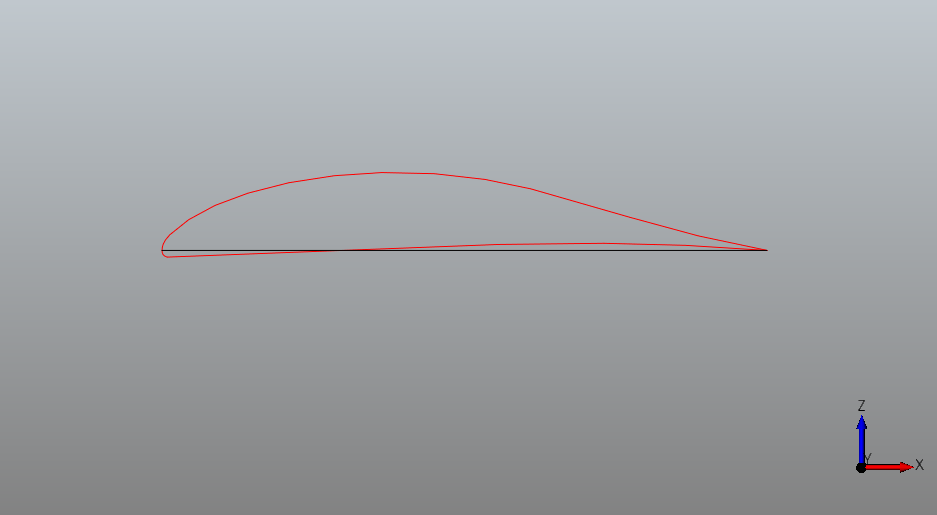
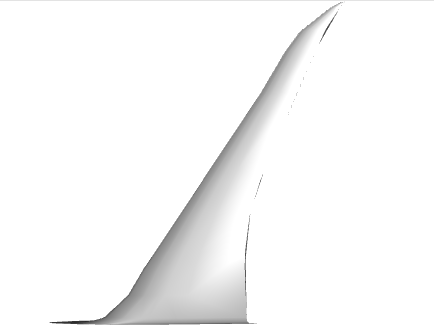
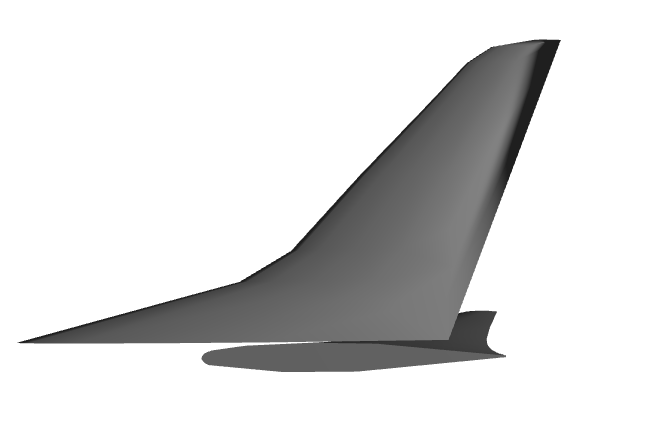
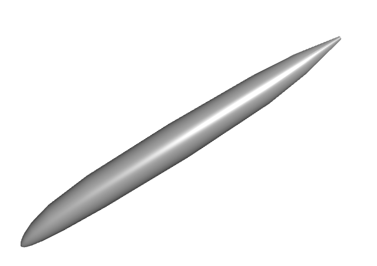
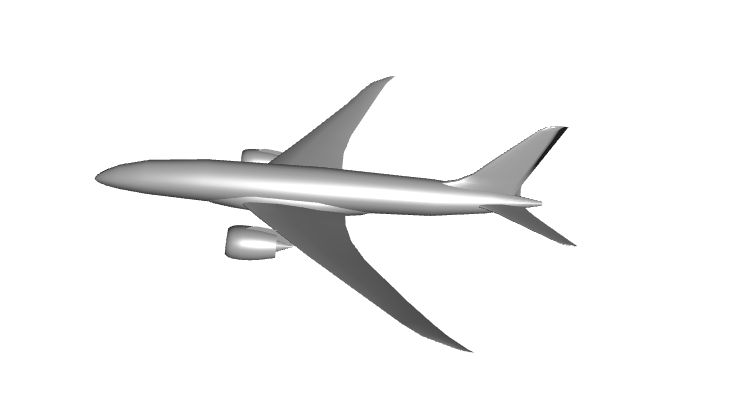
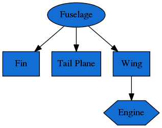

Examples
========

Airfoil
-------
This example on building an airfoil NURBS curve with occ_airconics is included in the [occ_airconics core Qt viewer examples](https://github.com/p-chambers/occ_airconics/tree/master/examples/core).

First import the primitives module in which the Airfoil class is contained and the `pythonocc-core` Qt viewer:
```python
from airconics import primitives
# Visualisation with Python-OCC (ensure plot windows are set to qt)
from OCC.Display.SimpleGui import init_display
display, start_display, add_menu, add_function_to_menu = init_display()
```

Next, define the inputs to Airfoil class. In this example, we'll use the `SeligProfile` type airfoil, leading edge point in origin, unit chord along x axis, no rotation around the x or y axes. 

*Note: This class also supports construction of NACA 4 digit profiles using input keyword `NACA4Profile`. See [Airfoil API reference](http://occ-airconics.readthedocs.io/en/latest/reference.html#airconics.primitives.Airfoil).*

```python
LEPoint = [0., 0., 0.]
ChordLength = 1
Rotation = 0
Twist = 0
AirfoilSeligName = 'dae11'

# Instantiate class to set up a generic airfoil with these basic parameters
Af = primitives.Airfoil(LEPoint, ChordLength, Rotation, Twist,
                        SeligProfile=AirfoilSeligName)
```

Finally, display the curve and chord line

```python
display.DisplayShape(Af.Curve, update=True)
display.DisplayShape(Af.ChordLine, update=True)
start_display()
```




Transonic Airliner
------------------

In this example, the transonic airliner geometry example from the Rhinoceros Airconics plugin [1] is shown. All renderings are static images here, but represent interactive renderings when run as an IPython notebook available [here](https://github.com/p-chambers/occ_airconics/blob/master/examples/notebooks/notebook_examples.ipynb). Interactive shapes can be viewed by clicking the shape hyperlinks however, as produced by the *PythonOCC* *x3dom* renderer.

For examples using the *pythonocc-core* Qt viewer, refer to the *occ-airconics* [examples/core directory](https://github.com/p-chambers/occ_airconics/tree/master/examples/core)

```python
import airconics
import airconics.AirCONICStools as act
from airconics.Addons.WebServer.TornadoWeb import TornadoWebRenderer
from IPython.display import display
```

### Parameter Definitions
Parameters used here correspond to a geometry similar to that of the Boeing 787-8


```python
Propulsion=1
EngineDia=2.9
FuselageScaling=[55.902, 55.902, 55.902]
WingScaleFactor=44.56
WingChordFactor=1.0
Topology=1
EngineSpanStation=0.31
EngineCtrBelowLE=0.3558
EngineCtrFwdOfLE=0.9837
Scarf_deg=3

# Derived Parameters
FuselageHeight = FuselageScaling[2]*0.105
FuselageLength = FuselageScaling[0]
FuselageWidth  = FuselageScaling[1]*0.106
WingApex = [0.1748*FuselageLength,0,-0.0523*FuselageHeight]
# Fin:
FinChordFact = 1.01
FinScaleFact = WingScaleFactor/2.032
# TailPlane
TPChordFact = 1.01
TPScaleFact = WingScaleFactor * 0.388
# Engine:
NacelleLength = 1.95*EngineDia
```

### Wing, Transonic Airliner

Formulation of lifting surfaces in `occ_airconics` (and AirCONICS) follows the suggestions in Sobester [2] in which geometry--attached curvilinear functionals are used instead of parameters for shape definition. That is, \\(G(\bf{f}, \bf{X})\\), where

$$\qquad \textbf{f} = \left[ f_1(\textbf{X}_1), f_2(\textbf{X}_2), ... f_m(\textbf{X}_m)\right],$$
and

$$\textbf{X}_i = \left[x_1^i, x_2^i,...\right], \forall i = 1,...m$$

as opposed to the conventional \\(G(\bf{X})\\) formulation where the shape \\(G\\) changes in response to changes in design parameters \\(\textbf{X}\\). The functions \\(f_i\\) are defined by:

> $$Sweep (\epsilon)$$

> $$Chord (\epsilon)$$

> $$Rotation (\epsilon)$$

> $$Twist (\epsilon)$$

> $$Airfoil (\epsilon)$$

where \\(\epsilon\\) is a functional parameters ranging from 0 at the root of the wing to 1 at the tip. Output of the airfoil function uses the `airconics.primitives.Airfoil` class here, which fits a NURBS curve to airfoil coordinates.

The following code demonstrates construction of a wing using built in examples for a transonic airliner wing and tailplane (below).


```python
# Import all example functional definitions for the Common Research Model (CRM) Wing:
from airconics.examples.wing_example_transonic_airliner import *

# Position of the apex of the wing
P = WingApex

# Class definition
NSeg = 11
ChordFactor = 1
ScaleFactor = 50

# Generate (surface building is done during construction of the class)
Wing = liftingsurface.LiftingSurface(P, mySweepAngleFunctionAirliner, 
                                        myDihedralFunctionAirliner, 
                                        myTwistFunctionAirliner, 
                                        myChordFunctionAirliner, 
                                        myAirfoilFunctionAirliner,
                                        SegmentNo=NSeg,
                                        ScaleFactor=WingScaleFactor,
                                        ChordFactor=WingChordFactor)

# Evaluate the root chord:
RootChord = Wing.RootChord

# Display
renderer = TornadoWebRenderer()
Wing.Display(renderer)
display(renderer)
```

[](_interact/x3domwing.html)

[Interactive x3dom output](_interact/x3domwing.html)


### Tailplane, Transonic Airliner

The same `Lifting Surface` class is used here to generate the fin and tailplane of the aircraft, using a different set of input functionals (also defined in `airconics.examples`).


```python
from OCC.gp import gp_Ax1, gp_Pnt, gp_Dir
from airconics.examples.tailplane_example_transonic_airliner import *

# Position of the apex of the fin
P = [36.98-0.49-0.02, 0.0, 2.395-0.141]

SegmentNo = 10

Fin = liftingsurface.LiftingSurface(P, mySweepAngleFunctionFin,
                                    myDihedralFunctionFin,
                                    myTwistFunctionFin,
                                    myChordFunctionFin,
                                    myAirfoilFunctionFin,
                                    SegmentNo=SegmentNo,
                                    ChordFactor=FinChordFact,
                                    ScaleFactor=FinScaleFact)

#    Create the rotation axis centered at the apex point in the x direction
RotAxis = gp_Ax1(gp_Pnt(*P), gp_Dir(1, 0, 0))


Fin.RotateComponents(RotAxis, 90)

# Position of the apex of the tailplane
P = [43, 0.000, 1.633+0.02]

SegmentNo = 100
ChordFactor = 1.01
ScaleFactor = 17.3

TP = liftingsurface.LiftingSurface(P, mySweepAngleFunctionTP,
                                   myDihedralFunctionTP,
                                   myTwistFunctionTP,
                                   myChordFunctionTP,
                                   myAirfoilFunctionTP,
                                   SegmentNo=SegmentNo,
                                   ChordFactor=TPChordFact,
                                   ScaleFactor=TPScaleFact)

# Display
renderer = TornadoWebRenderer()
Fin.Display(renderer)
TP.Display(renderer)
display(renderer)
```
[](_interact/x3domfin_tp.html)

[Interactive x3dom Fin](_interact/x3domfin_tp.html)


### Fuselage Transonic Airliner

Fuselage shapes are created following the parameterisation used in Sobester [3]. That is, the outer mould line (OML) is split into a `Nose`, `Central` and `Tail` section, the length of which is described on input to `Fuselage` class as a percentage of the total length. Rib curves are then formed by fitting a NURBS curve to the intersection points of sectional planar cuts and the guide curves of the extremeties of the OML e.g. Port, top and bottom curves. The OML is fitted in `occ_airconics` using the Open CASCADE `ThruSections` loft.


```python
from airconics.fuselage_oml import Fuselage

NoseLengthRatio=0.182
TailLengthRatio=0.293

Fus = Fuselage(NoseLengthRatio, TailLengthRatio, Scaling=FuselageScaling,
             NoseCoordinates=[0., 0., 0],
             CylindricalMidSection=False,
             Maxi_attempt=5)

# Display
renderer = TornadoWebRenderer()
Fus.Display(renderer)
display(renderer)
```

    ('Surface fit attempt ', 1)
    ('Attempting thrusections surface fit with network density                setup ', array([35, 30, 15,  5, 20]))
    Network surface fit succesful on attempt 1


[](_interact/x3domfuselage.html)

[Interactive x3dom Fuselage](_interact/x3domfuselage.html)


### Wing-Body Fairing:
The wing-body fairing is here created as a simple ellipsoid shape around the root section of the wing. 

*Note that this component will be displayed only in the final model.*


```python
# WingBodyFairing: A simple ellipsoid:
from airconics.base import AirconicsShape
WTBFZ = RootChord*0.009 #787: 0.2
WTBFheight = 1.8*0.1212*RootChord #787:2.7
WTBFwidth = 1.08*FuselageWidth
WTBFXCentre = WingApex[0] + RootChord/2.0 + RootChord*0.1297 # 787: 23.8
WTBFlength = 1.167*RootChord #787:26

WBF_shape = act.make_ellipsoid([WTBFXCentre, 0, WTBFZ], WTBFlength, WTBFwidth, WTBFheight)
WBF = AirconicsShape(components={'WBF': WBF_shape})
```

### Engine + Pylon

First, obtain the wing section and chord at which the engine will be fitted, then fit then engine. The default inputs to the Engine class produce a turbofan engine with Nacelle similar to that of the RR Trent 1000 / GEnx and its pylon (**currently a flat plate only**).


```python
from airconics import engine

EngineSection, Chord = act.CutSect(Wing['Surface'], EngineSpanStation)
CEP = Chord.EndPoint()
Centreloc = [CEP.X()-EngineCtrFwdOfLE*NacelleLength,
            CEP.Y(), 
            CEP.Z()-EngineCtrBelowLE*NacelleLength]

eng =  engine.Engine(Chord,
                     CentreLocation=Centreloc,
                     ScarfAngle=Scarf_deg,
                     HighlightRadius=EngineDia/2.0,
                     MeanNacelleLength=NacelleLength)

# Display
renderer = TornadoWebRenderer()
eng.Display(renderer)
display(renderer)
```
[](_interact/x3domengine.html)

[Interactive x3dom Engine](_interact/x3domengine.html)


### Miscelaneous operations

```python
# Trim the inboard section of the main wing:
CutCirc = act.make_circle3pt([0,WTBFwidth/4.,-45], [0,WTBFwidth/4.,45], [90,WTBFwidth/4.,0])
CutCircDisk = act.PlanarSurf(CutCirc)
Wing['Surface'] = act.TrimShapebyPlane(Wing['Surface'], CutCircDisk)

#Mirror the main wing and tailplane using class methods:
Wing2 = Wing.MirrorComponents(plane='xz')
TP2 = TP.MirrorComponents(plane='xz')
eng2 = eng.MirrorComponents(plane='xz')
```

    can work? True
    error status: - Ok
    Note: MirrorComponents currently mirrors only the shape
    components, other attributes will not be mirrored
    
    Note: MirrorComponents currently mirrors only the shape
    components, other attributes will not be mirrored
    
    Note: MirrorComponents currently mirrors only the shape
    components, other attributes will not be mirrored
    


### Ipython Cell Renderer:
Now render the finished airliner model:

```python
from airconics.Addons.WebServer import TornadoWeb
renderer = TornadoWeb.TornadoWebRenderer()
#    display all entities:
# Fuselage and wing-body fairing
Fus.Display(renderer)
WBF.Display(renderer)

# #The Wings:
Wing.Display(renderer)
Wing2.Display(renderer)

#The Tailplane:
TP.Display(renderer)
TP2.Display(renderer)

#The Fin:
Fin.Display(renderer)

#The Engines:
eng.Display(renderer)
eng2.Display(renderer)

# Finally show the renderer
display(renderer)
```


[](_interact/x3domairliner.html)

[Interactive x3dom Airliner](_interact/x3domairliner.html)


### Topology model

This is a work in progress towards a topologically flexible model based on the tree-type definition described in Sobester [2]. Note the geometry is not currently defined by the tree however, the tree is simply stored as a result of adding components - this is for demonstration only, and the process is yet to be automated.

The mirror line is also not yet included in this representation, however should exist between central objects (Fuselage, Fin) and the mirrored objects (Tail Plane, Wing, Engine).


```python
from airconics.topology import Topology
from IPython.display import Image
import pydot

topo = Topology()

# Note: no checks are done on the validity of the tree yet,
#  it is the users responsibility to input correct affinities
topo.AddPart(Fus, 'Fuselage', 3)
topo.AddPart(Fin, 'Fin', 0)
topo.AddPart(TP, 'Tail Plane', 0)
topo.AddPart(Wing, 'Wing', 1)
topo.AddPart(eng, 'Engine', 0)

topo.Display(renderer)

# print the Topology (resembles a LISP tree)
print(topo)

# Create the graph with pydot
graph = pydot.graph_from_dot_data(topo.export_graphviz())
Image(graph.create_png())
```

    E(L, L, L(P))





## References

[1] Sobester, A. and Forrester, A. I. J., Aircraft Aerodynamic Design:
	Geometry and Optimization, Wiley, 2014.

[2] Sobester, A., “Four Suggestions for Better Parametric Geometries,”
    10th AIAA Multidisciplinary Design Optimization Conference,
    AIAA SciTech, American Institute of Aeronautics and Astronautics,
    jan 2014.
    
[3] Sobester, A., “Self-Designing Parametric Geometries,” 56th AIAA/ASCE/AH-
    S/ASC Structures, Structural Dynamics, and Materials Conference, AIAA
    SciTech, American Institute of Aeronautics and Astronautics, jan 2015.