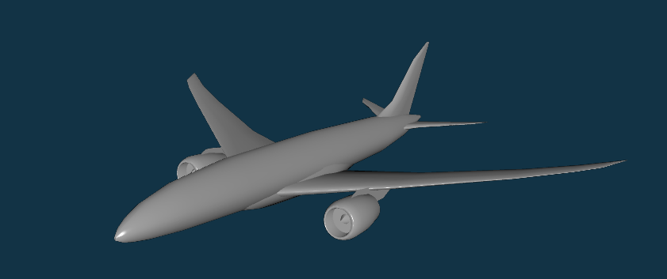

.. airconics documentation master file, created by
   sphinx-quickstart on Thu Jan 14 11:58:48 2016.
   You can adapt this file completely to your liking, but it should at least
   contain the root `toctree` directive.

Welcome to the occ_airconics documentation!
===========================================

*occ_airconics* implements a scripted aircraft geometry package for Python, powered by `Open CASCADE <http://www.opencascade.com/>`_ and `PythonOCC <http://www.pythonocc.org/>`_.

While the majority of detailed aircraft design is performed by expert users of high-level Computer Aided Drawing (CAD) software, the bottom-up construction philosophy *'aircraft geometry as computer code'*  has recently amassed interest in vehicle concept design and multidisciplinary optimisation. Primary aims of *occ_airconics* are to provide one such implementation through generic aircraft primitives, such as the ``Airfoil``, ``LiftingSurface``, ``Engine`` and ``Fuselage`` classes, with a view that they will be used in configuration-level geometry parametrisation and optimisation. An example of this functionality lies in the built-in `transonic airliner model <https://github.com/p-chambers/occ_airconics/blob/master/examples/core/transonic_airliner.py>`_, capable of producing a range of conventional geometries (see above) and a box-wing style aircraft.

One of the key advantages of *occ_airconics* is that it benefits from being built on the open-source full CAD kernel `Open CASCADE <http://www.opencascade.com/>`_  available through `PythonOCC <http://www.pythonocc.org/>`_, and therefore has access to an extensive and well-supported library of fast geometry manipulation tools including NURBS (Non-Uniform Rational B-Spline) curves and surfaces. 

*occ_airconics* offers a fully cross platform and open source porting of core classes from the popular `AirCONICS <https://aircraftgeometrycodes.wordpress.com/>`_ (**A** ircraft **CON** figuration through **I** ntegrated **C** rossdisciplinary **S** cripting) plug-in for Rhinoceros 3D. Users of the original *AirCONICS* software should be aware however that the functionality of the original API has changed in *occ_airconics* to fit with the environments and ideologies of CPython and *pythonocc*. In particular, the base classes ``AirconicsShape`` and ``AirconicsCollection`` are added (see `API reference <http://occ-airconics.readthedocs.io/en/latest/reference.html>`_ for details).

Installation of *occ_airconics* requires a recent version of *PythonOCC*, and is tested mainly on version 0.16.3 available in the *conda* package - see `Installation <http://occ-airconics.readthedocs.io/en/latest/installation.html>`_ for more information. 

Refer to the `examples <http://occ-airconics.readthedocs.io/en/latest/examples.html>`_ and `API reference <http://occ-airconics.readthedocs.io/en/latest/reference.html>`_ for a demonstration of the usage of *occ_airconics*. Contributions are welcome, and developers should refer to the `Open CASCADE <http://www.opencascade.com/doc/occt-6.9.1/refman/html/index.html>`_ and `pythonocc <http://api.pythonocc.org/>`_ API documentation for guidelines on manipulation of underlying geometry kernel.

Enjoy *occ_airconics*!

Contents:

.. toctree::
   :maxdepth: 4

   examples
   installation
   reference

Acknowledgements
----------------
**occ_airconics** began as fork of `AirCONICS <https://aircraftgeometrycodes.wordpress.com/>`_, and therefore large parts of the code, documentation, examples and manual are attributed to the AirCONICS developers. For more detail on AirCONICS, please refer to the accompanying reference book or recent papers:

[1] Sobester, A. and Forrester, A. I. J., Aircraft Aerodynamic Design:
Geometry and Optimization, Wiley, 2014.

[2] Sobester, A., “Four Suggestions for Better Parametric Geometries,”
10th AIAA Multidisciplinary Design Optimization Conference,
AIAA SciTech, American Institute of Aeronautics and Astronautics,
jan 2014.
    
[3] Sobester, A., “Self-Designing Parametric Geometries,” 56th AIAA/ASCE/AH-
S/ASC Structures, Structural Dynamics, and Materials Conference, AIAA
SciTech, American Institute of Aeronautics and Astronautics, jan 2015.

Indices and tables
==================

* :ref:`genindex`
* :ref:`modindex`
* :ref:`search`

